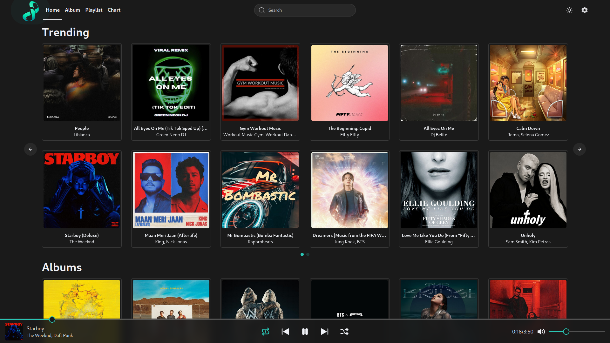

<div align=center>

<!-- labels -->

![][views] ![][stars] ![][forks] ![][issues] ![][license] ![][repo-size]

<!-- logo/title -->

<picture>
  <source media="(prefers-color-scheme: dark, (max-width:300px))" srcset="./public/images/logo1920.png">
  <source media="(prefers-color-scheme: light,(max-width:300px))" srcset="./public/images/logo1500.png">
  
</picture>

### [WIP] 🎵 A Simple Music Player Web App made with ⚛️ React + Vite + Tailwind and Redux Toolkit.



**[<kbd> <br> &nbsp;**Live Demo**&nbsp; <br> </kbd>][site]**

## Building from Source

</div>

- Fetch latest source code from master branch.

```
git clone https://github.com/Khushal-ag/infinitunes
cd infinitunes
```

- Rename **.env.example** => **.env.local**, add your own [**JioSaavn API**][api] Endpoint.

```js
VITE_JIOSAAVN_ENDPOINT = "https://saavn.me" <- change this
```

- Run the app with VS Code or the command line:

```
pnpm i
pnpm dev
```

### Build and Run the Docker Image

> **Warning**
> You need to have [Docker](https://docs.docker.com/get-docker/) installed on your system.
> You might need to run the following commands with `sudo` depending on your system.

- Start Docker daemon (Skip if already running)

```
sudo dockerd
```

- Build the image

```
docker build -t infinitunes .
```

- Run the image

```
docker run -p 4173:4173 infinitunes
```

- Open http://localhost:4173 to view it in the browser.

- Stop the container

```
docker ps
```

```
docker stop <container-id>
```

<div align = center>

### Deploy Your Own

You can deploy your own hosted version of `infinitunes`. Just click the link below to deploy a ready-to-go version to Vercel.

[](https://vercel.com/new/clone?repository-url=https://github.com/Khushal-ag/infinitunes&env=VITE_JIOSAAVN_ENDPOINT&project-name=infinitunes&repo-name=infinitunes)

#### [JioSaavn API (Unofficial)][api] by [Sumit Kolhe][cc], [API Docs][api-docs]

## Contributors:

[![][contributors]][contributors-graph]

_Note: It may take up to 24h for the [contrib.rocks][contrib-rocks] plugin to update because it's refreshed once a day._

</div>

<!----------------------------------{ Labels }--------------------------------->

[views]: https://komarev.com/ghpvc/?username=infinitunes&label=view%20counter&color=red&style=flat
[repo-size]: https://img.shields.io/github/repo-size/Khushal-ag/infinitunes
[issues]: https://img.shields.io/github/issues-raw/Khushal-ag/infinitunes
[license]: https://img.shields.io/github/license/Khushal-ag/infinitunes
[forks]: https://img.shields.io/github/forks/Khushal-ag/infinitunes?style=flat
[stars]: https://img.shields.io/github/stars/Khushal-ag/infinitunes
[contributors]: https://contrib.rocks/image?repo=Khushal-ag/infinitunes&max=500
[contributors-graph]: https://github.com/Khushal-ag/infinitunes/graphs/contributors
[contrib-rocks]: https://contrib.rocks/preview?repo=Khushal-ag%2Finfinitunes

<!-----------------------------------{ Links }---------------------------------->

[site]: https://infinitunes.vercel.app

<!------------------------------------{ api }----------------------------------->

[api]: https://github.com/sumitkolhe/jiosaavn-api
[api-docs]: https://docs.saavn.me
[cc]: https://github.com/sumitkolhe
