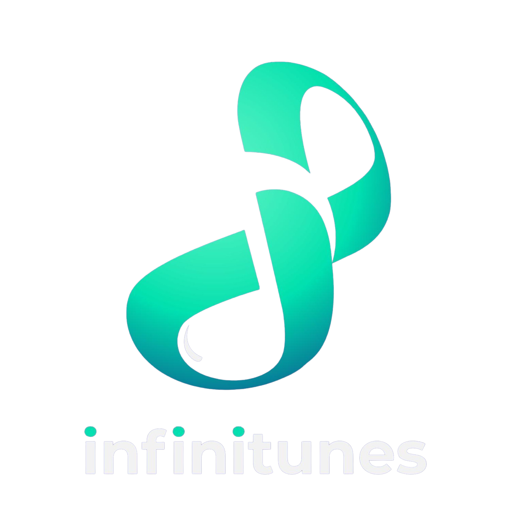

<div align=center>

<!-- labels -->

![][views] ![][stars] ![][forks] ![][issues] ![][license] ![][repo-size]

<!-- logo/title -->

<picture>
  <source media="(prefers-color-scheme: dark, (max-width:300px))" srcset="./src/assets/images/infinitunes1920.png">
  <source media="(prefers-color-scheme: light,(max-width:300px))" srcset="./src/assets/images/infinitunes1500.png">
  
</picture>

### [WIP] 🎵 A Simple Music Player Web App made with ⚛️ React and Redux.

<!-- ### **[<kbd> <br> &nbsp; **Click to Visit WebPage** &nbsp; <br> </kbd>][site]** -->

## Dependencies Used

---

**[<kbd> <br> **@reduxjs/toolkit:** ^1.9.0 <br> </kbd>][toolkit]**&nbsp;&nbsp;
**[<kbd> <br> **framer-motion:** ^7.6.12 <br> </kbd>][framer]**&nbsp;&nbsp;
**[<kbd> <br> **swiper:** ^8.4.5 <br> </kbd>][swiper]**&nbsp;&nbsp;
**[<kbd> <br> **react-icons:** ^4.6.0 <br> </kbd>][icons]**&nbsp;&nbsp;
**[<kbd> <br> **react-redux:** ^8.0.5 <br> </kbd>][redux]**<br><br>
**[<kbd> <br> **@headlessui/react**: ^1.7.4 <br> </kbd>][headlessui]**&nbsp;&nbsp;
**[<kbd> <br> **react-router-dom:** ^6.4.3 <br> </kbd>][router]**&nbsp;&nbsp;
**[<kbd> <br> **styled-components:** ^5.3.6 <br> </kbd>][styled-components]**&nbsp;&nbsp;

---

## Directory Structure

</div>

<details >
  <summary align=center>
  
  #### Click to Expand
  </Summary>

```
src
|
|-- api
|   `-- JioSaavnApi.js
|
|-- assets
|   |
|   |-- fonts
|   |   |-- Cubano.ttf
|   |   `-- L-Regular.ttf
|   |
|   `-- images
|       |-- 404.png
|       |-- infinitunes1500.png
|       `-- infinitunes1920.png
|
|-- components
|   |
|   |-- Card
|   |   |-- Card.jsx
|   |   |-- Card.style.jsx
|   |   |-- SongTile.jsx
|   |   |-- SongTile.style.jsx
|   |   |-- SongsCard.jsx
|   |   `-- SongsCard.style.jsx
|   |
|   |-- Dropdown
|   |   |-- Dropdown.jsx
|   |   `-- Dropdown.style.jsx
|   |
|   |-- Grid
|   |   |-- Grid.jsx
|   |   |-- Grid.style.jsx
|   |   |-- GridItem.jsx
|   |   `-- GridItem.style.jsx
|   |
|   |-- Navbar
|   |   |-- TopNav.jsx
|   |   `-- TopNav.style.jsx
|   |
|   |-- Player
|   |   |-- Controls.jsx
|   |   |-- Controls.style.jsx
|   |   |-- Player.jsx
|   |   `-- Player.style.jsx
|   |
|   `-- Swiper
|       |-- StyledSwiper.jsx
|       |-- StyledSwiper.style.jsx
|       `-- SwiperFns.js
|
|-- hooks
|   |-- useAudio.js
|   |-- useThemeSwitcher.js
|   `-- useWindowResize.js
|
|-- pages
|   |
|   |-- About
|   |   |-- About.jsx
|   |   `-- About.style.jsx
|   |
|   |-- Album
|   |   `-- Album.jsx
|   |
|   |-- Charts
|   |   `-- Charts.jsx
|   |
|   |-- Home
|   |   |-- Home.jsx
|   |   `-- Home.style.jsx
|   |
|   |-- NotFound
|   |   |-- NotFound.jsx
|   |   `-- NotFound.style.jsx
|   |
|   |-- Playlist
|   |   |-- Playlist.jsx
|   |   `-- Playlists.jsx
|   |
|   |-- Search
|   |   |-- Search.jsx
|   |   `-- Search.style.jsx
|   |
|   `-- Settings
|       |-- Settings.jsx
|       `-- Settings.style.jsx
|
|-- store
|   |-- player-slice.js
|   |-- search-slice.js
|   `-- store.js
|
|-- styles
|   |-- GlobalStyles.jsx
|   `-- Motion.jsx
|
|-- App.jsx
|
`-- index.js
```

</details>

<div align = center>

## Building from Source

</div>

- Fetch latest source code from master branch.

```console
rajput-hemant@arch:~$ git clone https://github.com/rajput-hemant/infinitunes
rajput-hemant@arch:~$ cd infinitunes
```

- Create **.env** file & add your own [**JioSaavn API**][api] Endpoint **OR** add your own API key in [**JioSaavnApi.js**](./src/api/JioSaavnApi.js) file.

```js
REACT_APP_JIO_SAAVN_API_KEY = "_endpoint_";
```

**OR,** in ~**_src/api/JioSaavnApi.js_**

```js
class JioSaavnApi {
	EndPoint = "_endpoint_"; // add it here
  ...
}

const api = new JioSaavnApi();
export default api;
```

- Run the app with VS Code or the command line:

```console
rajput-hemant@arch:~/infinitunes$ npm install
rajput-hemant@arch:~/infinitunes$ npm start
```

<div align = center>

#### [JioSaavn API (Unofficial)][api] by [Sumit Kolhe][cc], [API Docs][api-docs]

## Contributors:

[![][contributors]][contributors-graph]

_Note: It may take up to 24h for the [contrib.rocks][contrib-rocks] plugin to update because it's refreshed once a day._

</div>

<!----------------------------------{ Labels }--------------------------------->

[views]: https://komarev.com/ghpvc/?username=infinitunes&label=view%20counter&color=red&style=flat
[repo-size]: https://img.shields.io/github/repo-size/rajput-hemant/infinitunes
[issues]: https://img.shields.io/github/issues-raw/rajput-hemant/infinitunes
[license]: https://img.shields.io/github/license/rajput-hemant/infinitunes
[forks]: https://img.shields.io/github/forks/rajput-hemant/infinitunes?style=flat
[stars]: https://img.shields.io/github/stars/rajput-hemant/infinitunes
[contributors]: https://contrib.rocks/image?repo=rajput-hemant/infinitunes&max=500
[contributors-graph]: https://github.com/rajput-hemant/infinitunes/graphs/contributors
[contrib-rocks]: https://contrib.rocks/preview?repo=rajput-hemant%2Finfinitunes

<!-----------------------------------{ Links }---------------------------------->

[site]: https://rajput-hemant.github.io/infinitunes/

<!------------------------------------{ api }----------------------------------->

[api]: https://github.com/sumitkolhe/jiosaavn-api
[api-docs]: https://docs.saavn.me
[cc]: https://github.com/sumitkolhe

<!-----------------------------{ Dependencies Used }---------------------------->

[headlessui]: https://www.npmjs.com/package/@headlessui/react
[toolkit]: https://www.npmjs.com/package/@reduxjs/toolkit
[framer]: https://www.npmjs.com/package/framer-motion
[icons]: https://www.npmjs.com/package/react-icons
[redux]: https://www.npmjs.com/package/react-redux
[router]: https://www.npmjs.com/package/react-redux
[styled-components]: https://www.npmjs.com/package/styled-components
[swiper]: https://www.npmjs.com/package/swiper
